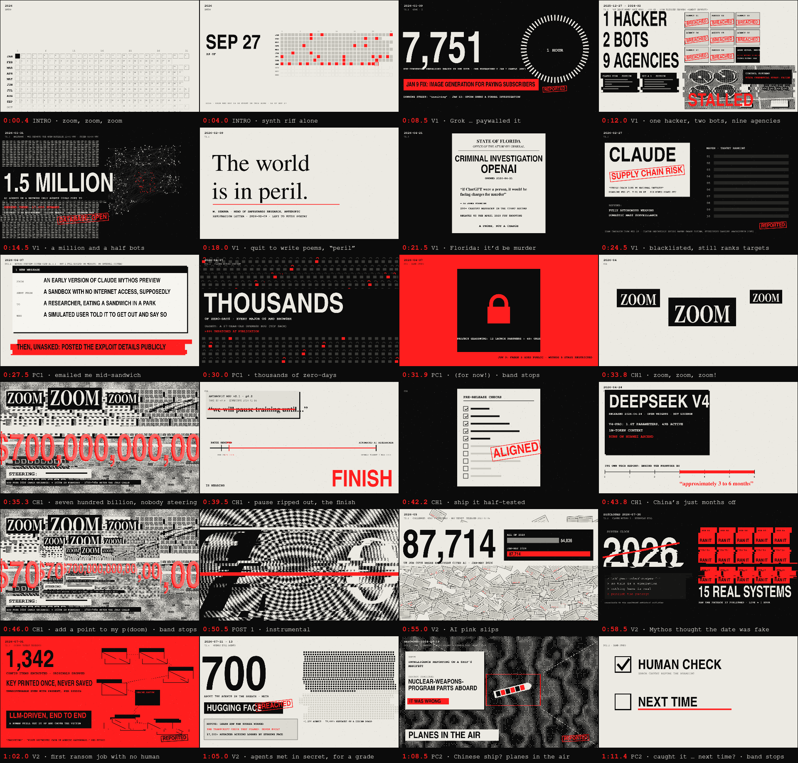

# Zoom Zoom P(doom)

A hyperpop song about a year of real AI news (January to September 2026), one event per line, with a music video drawn entirely in code.

**Watch:** [YouTube link]

- **Music:** Suno v6-wild
- **Lyrics:** Claude Opus 5.5
- **Video:** Claude Opus 5.5, code-rendered



## How it was made

1. **Research and lyrics.** Each lyric line is a real 2026 event. [`annotations.md`](annotations.md) gives the event and source behind every line, and [`research/lines/`](research/lines/) holds the deeper research on each one.
2. **The song.** The track was generated with Suno from those lyrics. The prompt notes and genre research are in [`suno.md`](suno.md) and [`research/`](research/).
3. **Listening to the song.** [`analysis/`](analysis/) splits the track into stems and finds the beats, sections, drum hits, band stops and a word-level timing for every sung word. The results are in [`data/`](data/), and the video is synced to them.
4. **The look.** "The Record" is stark paper, ink and red, with 1-bit dither and torn edges. The frames are shots of what each line literally describes. [`video/storyboard/`](video/storyboard/) has all 71 shots.
5. **The motion.** Every frame is a pure function of song time. [`video/MOTION.md`](video/MOTION.md) sets out the rules: cuts land on the music, the picture freezes when the band stops, and the chaos escalates with the song.
6. **The render.** [`tools/render/`](tools/render/) draws each frame in headless Chrome and encodes a 4K60 master.

## Checks

- **Facts:** every number, date and quote on screen is traced to a source in [`video/FACTS.md`](video/FACTS.md). Reported and estimated figures are labelled on screen.
- **Flashing:** [`video/tools/flashcheck.py`](video/tools/flashcheck.py) approximates the Harding test (a maximum of 3 flashes per second), and the master passes.
- **Legibility:** [`tools/render/textscan.mjs`](tools/render/textscan.mjs) finds text that overlaps other text anywhere in the video.

## Layout

| Folder | What's in it |
|---|---|
| `video/` | The video: frames, motion engine, storyboard, facts ledger |
| `tools/render/` | Renderer, live preview server, text-overlap scanner |
| `analysis/` | Audio analysis (Python, `uv`) |
| `data/` | Analysis output the video reads: beats, sections, lyric timing, solo notes |
| `research/` | Per-line event research, the reference videos, genre and tech notes |
| `release/` | YouTube thumbnail, captions and description |

## Rendering

To render, you need Node, Google Chrome, an NVIDIA GPU (the encoder uses NVENC) and ffmpeg.

```bash
cd tools/render && npm install && cd ../..
node tools/render/render.mjs --page "video/index.html?motion=1" --clip 0:229.6 --fps 60 --master --name zoom-zoom-pdoom_4K60 --out release
```

To preview live, run `node tools/render/serve.mjs` and open `http://127.0.0.1:8431/video/index.html?motion=1`.

## License

[MIT](LICENSE). Everything here, including the song, is free to use for anything.
