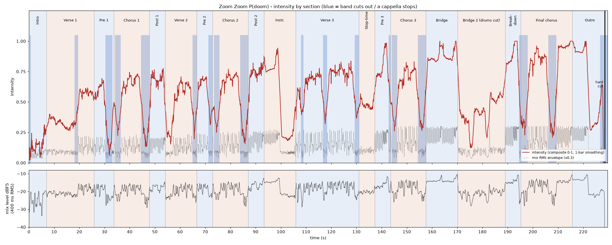

# Zoom Zoom P(doom): audio analysis and vibe map

`song.wav` (3:49.60, 48 kHz, stereo) is the **chiptune-heavy hyperpop Suno version** described in `suno.md`, not the "~120 BPM bright synth-pop" of `lyrics.md`. The evidence:

- It runs at **153 BPM** (152.996 measured; the prompt asked for 152).
- It is in **F major**.
- It has the instrumental solo, the stop-time and the drums-cut bridge.
- It has the shouted ad-libs from `suno.md`: "FOR NOW!", "hit the gas!" and "WHO CAN TELL?".

All times are in seconds from sample 0 of `song.wav`. Bar numbers follow `data/audio.json`: bar *k* starts at `downbeats[k]`, bar 0 starts at 0.737 s, and one bar lasts 1.5687 s.

Machine-readable data:

- `data/audio.json`: the grid, sections, parts, events, the 25 sync moments, 60 fps envelopes, onsets and key.
- `data/lyrics.json`: word timings of what is actually sung.

The intensity plot is `research/audio-intensity.png`.

## 1. Section timeline

"Energy" is the mean of the composite intensity curve for the section. It runs from 0 to 1 and is relative to the whole song (see section 2). The bar counts are musical bars at 153 BPM.

| Start | End | Section | Bars | Energy | What's happening musically | Vibe |
|---|---|---|---|---|---|---|
| 0:00.00 (0.00) | 0:07.01 (7.01) | **Intro** | 4, plus a 2-beat pickup (bars -1 to 3) | 0.14, low | At 0.33, three pitched "zoom" vocal chops play alone. At 0.74, a gated, detuned synth-stab riff plays alone for 3 bars, with no drums and no bass. At 5.44, distorted bass drops in under a stuttered "zoom-zoom-zoom..." chop roll. | A glitchy alarm clock: a toy riff and a stutter that promise trouble. |
| 0:07.01 (7.01) | 0:25.84 (25.84) | **Verse 1** | 12 (4-15) | 0.41, mid | "Grok" lands at 7.03. The sneering, hard-autotuned sing-rap runs over bass only for 7 bars, with almost no synth. Bar 11 (18.00) is a build bar: the bass drops out and the drums fade in. At 19.56 the beat kicks in under "Florida says": kick on 1 and on the and-of-3, snare on 2 and 4. | A deadpan news-crawl rap. Tension coils, then the floor arrives. |
| 0:25.84 (25.84) | 0:33.68 (33.68) | **Pre-Chorus 1** | 5 (16-20) | 0.44, mid | "Mythos, baby..." runs over the beat. At 30.54 the band stops dead on "so they kept you in a box". At 31.74 comes a shouted "FOR NOW!", doubled on lead and backing. A white-noise riser starts at 32.11, and a 16th-note snare roll runs from 32.89 into the drop. | Flirty menace, then a held breath and a shout. |
| 0:33.68 (33.68) | 0:47.80 (47.80) | **Chorus 1** | 9 (21-29) | 0.51, high | At 33.68 the drop hits on "ZOOM, ZOOM, ZOOM!". Bar 22 (35.25) is nearly empty, with the bass out, under "Seven hundred billion". The groove returns at 36.82. The high chorus melody (around A4) sits over drums and bass, and the synth lead is mostly absent. At 44.66 the band cuts: a 2-bar a cappella "Zoom, zoom, zoom, add a point to my P-doom", with a melismatic "doom". | A chant-along panic attack. The stop turns the hook into a naked confession. |
| 0:47.80 (47.80) | 0:54.07 (54.07) | **Post-Chorus 1** | 4 (30-33) | 0.66, high | Blown-out four-on-the-floor 808s hit on every beat. The screaming synth lead enters, answered by pitched vocal chops (49.4-50.6 and 52.5-54.1). A roll plays at 53.26. The "A" of verse 2's "A-I" is held from 53.3. | The first real rave release. The room shakes. |
| 0:54.07 (54.07) | 1:06.62 (66.62) | **Verse 2** | 8 (34-41) | 0.48, mid | At 54.07 the drums vanish, leaving bass and vocal for 2 bars. The beat returns at 57.21. At 65.05 the band stops for one bar under "...Hugging Face for a grade", leaving the vocal alone. | The same smirk at a faster pace. The stop lands like a rimshot. |
| 1:06.62 (66.62) | 1:12.89 (72.89) | **Pre-Chorus 2** | 4 (42-45) | 0.58, high | At 66.62 the band slams back in on "Chatbot, baby". At 71.33 there is a vocal-only stop on "Next time, will someone be there?". | A question left hanging in dead air. |
| 1:12.89 (72.89) | 1:27.01 (87.01) | **Chorus 2** | 9 (46-54) | 0.53, high | The same shape as chorus 1: the drop at 72.90, a near-empty bar 47, the groove at 76.04, and a 2-bar a cappella stop at 83.88. | The familiar hook with sharper edges. |
| 1:27.01 (87.01) | 1:33.29 (93.29) | **Post-Chorus 2** | 4 (55-58) | 0.73, very high | An 808 drop with the synth lead and chops, the loudest passage so far (-14.5 dBFS p90). A roll starts at 92.48. | A bigger, dirtier rave. |
| 1:33.29 (93.29) | 1:45.84 (105.84) | **Instrumental** | 8 (59-66) | 0.53 overall (about 0.8 during the solo, then about 0.2) | At 93.29 a synth-lead solo starts over pounding 808s, with a 16-hit roll from 98.0 to 99.5. At 99.56 the beat vanishes and the detuned synth plays alone for 3 bars. Drums creep back at 104.27, and "Eleven hundred" enters as a pickup at 105.47. | The machine takes the mic, then leaves a vacuum. |
| 1:45.84 (105.84) | 2:10.94 (130.94) | **Verse 3** | 16 (67-82) | 0.64, high | Frantic sing-rap over the full beat, with busier hats. At 107.97 there is a one-bar stop under the echoed "(hit the gas!)". At 116.82 the band stops on "a HOAX on the news", and the vocal pitch-dives on "news" (117.95-118.4). At 129.37 there is a stop on "the researcher's due in twenty-eight". | Speed-reading the apocalypse, with stops like record scratches. |
| 2:10.94 (130.94) | 2:17.21 (137.21) | **Verse 3 stop-time** | 4 (83-86) | 0.48, mid | The drums cut. A sustained bass drone and a detuned pad sit under a fast, exposed vocal: "Then they paused again... Hinton told Congress...". There are no hits, only the drone. | The floor drops out for cold testimony. |
| 2:17.21 (137.21) | 2:23.49 (143.49) | **Pre-Chorus 3** | 4 (87-90) | 0.76, very high | At 137.21 a four-on-the-floor 808 kick slams in on "Astra, darling". An 808 ratchet runs from 140.35 to 142.61, with the bass pulled back in bar 90. A 0.7 s stop at 142.75 leads into the chorus. | Not quiet at all: a heartbeat going into tachycardia. |
| 2:23.49 (143.49) | 2:37.60 (157.60) | **Chorus 3** | 9 (91-99) | 0.58, high | The drop at 143.49, a near-empty bar at 145.05, and the groove at 146.60. At 154.47 comes a 2-bar a cappella "P-doom" with a "doom-doom" melisma. | The hook again, but the voice is straining. |
| 2:37.60 (157.60) | 2:50.15 (170.15) | **Bridge** (half-time vocal) | 8 (100-107) | **0.87, peak** | At 157.60 the loudest groove of the song slams in (-12.5 dBFS p90): a four-on-the-floor 808 with bass and a synth pad, but no backbeat snare. Each vocal line stretches over 4 bars instead of 2, with held notes on "address" and "DNS". A roll plays at 163.09, then a 12-hit kick roll from 168.56 to 170.06. | Stadium-sized dread: slow words over a racing pulse. |
| 2:50.15 (170.15) | 3:08.98 (188.98) | **Bridge 2** (drums cut) | 12 (108-119) | 0.42, mid | At 170.15 the drums cut, leaving bass, detuned pads and an exposed vocal: "Dario says...", "Stargate's pulling...". A one-bar drum hit at 182.70 lands under "In court, families read the chat logs". The drums drop out again at 184.27. | The hush where the facts land. Eerie and intimate. |
| 3:08.98 (188.98) | 3:15.25 (195.25) | **Breakdown** | 4 (120-123) | **0.83, peak** | At 188.98 the kick pounds back in four-on-the-floor under "I've been laughing it off all year". A 16-hit 808 ratchet runs from 192.11 to 194.37. At 194.52 the band cuts, and "...kinda get the appeal" is sung a cappella. | A confession shouted over a heartbeat. The laugh stops being funny. |
| 3:15.25 (195.25) | 3:35.64 (215.64) | **Final Chorus** | 13 (124-136) | 0.72 (about 0.95 after 209.4) | Bar 124 is a cappella: "Zoom, zoom!" at 195.62. Bar 125 has light drums only. At 198.39 the band slams back on "nobody steering". At 206.23 comes a 2-bar a cappella stop, ending in "WHO CAN TELL?" at 208.99. At 209.37 the final drop hits: "Doom, doom, the warning shot sold for twelve-point-nine", then "Zoom, zoom, we'll be fine" at 212.84, with "fine" held. | Everything at once: denial, a dare, a crash. |
| 3:35.64 (215.64) | 3:49.60 (229.60) | **Outro** | 9 (137-145) | 0.59 (0.95, then 0.3) | At 215.64 an instrumental 808 drop plays with a laugh-like ad-lib (215.6-217.2). A roll plays at 220.35, and the loudness peaks at 221.13. At 221.92 the beat cuts and the synth plays alone. A "doom-doom-doom" stutter starts at 226.5. At **228.54 the whole mix hard-cuts to silence**, leaving 1.06 s of digital silence until the end of the file. | The party keeps going after the warning, then the power goes out. |

## 2. Intensity curve



`envelopes.intensity` in `data/audio.json` runs at 60 fps. It blends five parts: 35% mix level, 20% drum level, 15% level above 4 kHz, 15% onset density and 15% number of active layers. It is smoothed over one bar and normalised to 0-1. The blue bands in the plot are the moments when the band cuts out.

- **The shape is a sawtooth that climbs.** Every section builds to a groove and then gets yanked away by a stop. The detector found 18 band-out moments, and 11 of them are full vocal-only stops lasting a bar or more. The troughs in the plot are those cuts.
- **The first third** (0-47 s) climbs from 0.14 to about 0.7.
- **The middle** (47-157 s) plateaus between 0.5 and 0.8. Each rave block tops the one before: post-chorus 1 (0.66), then post-chorus 2 (0.73), then the solo (about 0.8), then pre-chorus 3 (0.76). The dips between them are the stops and the stop-time.
- **The peak is the bridge (157.6-170.2, 0.87), not the final chorus.** The next highest are the breakdown (0.83) and the final drop plus outro (about 0.95 to 1.0 from 209.4 to 221.9).
- **The deepest late trough is bridge 2** (170-189, down to about 0.12), where the drums cut. It works as the "calm before" the final run.
- **After the final drop** the curve stays pinned near 1.0 until 221.9, falls to 0.3 when only the synth is left, then hard-cuts.

For a frantic visual story, the natural escalation steps are post-chorus 1, post-chorus 2, the solo, pre-chorus 3, the bridge, the breakdown and the final drop. The bridge-2 hush and the a cappella bars are the places to breathe.

## 3. Top 25 sync moments

These are also in `audio.json` under `sync_moments` (with 2 extras in `extra_moments`). A bar.beat of "21.1" means beat 1 of bar 21.

| # | Time (s) | m:ss | Bar.beat | Type | Moment |
|---|---|---|---|---|---|
| 1 | 0.330 | 0:00.33 | pickup | hit | First sound: a "zoom-zoom-zoom" vocal-chop pickup |
| 2 | 5.443 | 0:05.44 | 3.1 | entry | Bass drops in with the stuttered "zoom" chop roll |
| 3 | 7.030 | 0:07.03 | 4.1 | vocal | "Grok": verse 1 starts (bass and vocal, no drums) |
| 4 | 19.561 | 0:19.56 | 12.1 | drop | Drums kick in under "Florida says" |
| 5 | 30.542 | 0:30.54 | 19.1 | stop | The band cuts out on "so they kept you in a box" |
| 6 | 31.738 | 0:31.74 | 19.4 | vocal | Shouted "FOR NOW!" |
| 7 | 32.895 | 0:32.90 | 20.3 | build | 16th-note snare roll (the noise riser starts at 32.11) |
| 8 | 33.679 | 0:33.68 | 21.1 | drop | **Chorus 1 drop: "ZOOM, ZOOM, ZOOM!"** |
| 9 | 44.660 | 0:44.66 | 28.1 | stop | The band cuts: a cappella "...add a point to my P-doom" (2 bars) |
| 10 | 47.797 | 0:47.80 | 30.1 | drop | **Post-chorus 1: blown-out 808s and the screaming synth lead** |
| 11 | 87.014 | 1:27.01 | 55.1 | drop | Post-chorus 2 drop, after the second a cappella stop (83.88) |
| 12 | 99.563 | 1:39.56 | 63.1 | stop | The beat vanishes mid-solo, leaving the synth alone for 3 bars |
| 13 | 105.465 | 1:45.47 | 66.4 | vocal | "Eleven hundred": verse 3 pickup (drums back at 105.84) |
| 14 | 116.780 | 1:56.78 | 73.4 (just before 74.1) | stop | "a HOAX on the news": a one-bar band stop, with a pitch-dive on "news" at 117.95 |
| 15 | 130.936 | 2:10.94 | 83.1 | stop | Stop-time: the drums cut, leaving a drone under "Then they paused again" |
| 16 | 137.211 | 2:17.21 | 87.1 | drop | Pre-chorus 3: the four-on-the-floor kick slams in on "Astra, darling" |
| 17 | 143.485 | 2:23.49 | 91.1 | drop | Chorus 3 drop, after an 808 roll (140.35) and a 0.7 s stop (142.75) |
| 18 | 157.603 | 2:37.60 | 100.1 | drop | **Bridge drop: the loudest groove of the song** |
| 19 | 170.153 | 2:50.15 | 108.1 | stop | The kick roll ends and the drums cut: an exposed "Dario says..." |
| 20 | 188.977 | 3:08.98 | 120.1 | drop | Breakdown: the kick pounds back in on "I've been laughing it off" |
| 21 | 194.517 | 3:14.52 | 123.3 | stop | The 808 ratchet ends and the band cuts: **the a cappella start** into the final chorus ("Zoom, zoom!" at 195.62) |
| 22 | 198.389 | 3:18.39 | 126.1 | drop | Final chorus: the band slams back on "nobody steering" |
| 23 | 208.990 | 3:28.99 | 132.4 | vocal | Shouted "WHO CAN TELL?" ends the last a cappella stop (which started at 206.23) |
| 24 | 209.369 | 3:29.37 | 133.1 | drop | **Final drop: "Doom, doom, the warning shot sold for twelve-point-nine"** |
| 25 | 228.541 | 3:48.54 | 145.1 (just before beat 2) | end | **Hard cut to silence** in the middle of the last "doom" |

There are two extras. At 215.644 (bar 137.1) the outro drop hits with the laugh ad-lib. At 221.919 (bar 141.1) the beat cuts and the synth plays alone.

There is no key-change moment to sync to (see section 4). Every stop, drop, roll and drums-in or drums-out change is listed in `events[]`, 87 events in total.

## 4. Tempo, key and meter

- **Tempo: 152.996 BPM, constant for the whole song.** The beat period is 0.392166 s and one bar is 1.56867 s.
  - The tempo is a least-squares fit to 584 Beat This! beats. The residual SD is 9.4 ms, which is about the model's 20 ms frame quantisation, and there is no drift in any 20 s window.
  - The phase is shifted -6 ms onto the kick attacks.
  - All-In-One (allin1), run independently, reports "154 BPM" as a rounded label. Its beats fall within 0.6 ms (median) of this grid, and 100% of its downbeats match ours.
  - Neither `suno.md`'s "152" nor `lyrics.md`'s "~120" is right. Suno generated 153.
- **Meter: 4/4 throughout.** There are no dropped or added beats: all 146 Beat This! downbeats and all 140 allin1 downbeats fall on the same phase.
  - The first beat is at 0.345 and the first downbeat at 0.737. The song opens with a 2-beat pickup.
  - The song is 146 bars long, and bar 145 is cut short by the hard stop.
- **No tempo change and no true half-time.**
  - The bridge's "half-time" exists only in the vocal phrasing: its lines span 4 bars instead of 2, with long held notes. Underneath, the 808 kick plays four-on-the-floor at 153 with no backbeat snare, so the bridge feels bigger rather than slower.
  - The drum patterns alternate between two feels:
    - Verses and choruses: a trap-ish backbeat, with kick on beat 1 and the and-of-3, and snare on 2 and 4.
    - Post-choruses, the solo, pre-chorus 3, the bridge, the breakdown, the final drop and the outro: pumping four-on-the-floor 808s.
- **Key: F major** (essentia KeyExtractor: edma, bgate, temperley, krumhansl and shaath all agree). Verse 1, the stop-time, pre-chorus 3, bridge 2 and the breakdown lean to the relative D minor.
- **There is no key change in the final chorus**, even though `lyrics.md` asks for one. The chorus melody sits on the same pitches in all four choruses: the median lead pitch of "Seven hundred billion..." is MIDI 69.0 (A4) in each. The per-section key estimates stay F major or D minor.

## 5. Lyric deviations (sung vs written)

These are recorded per line in `lyrics.json` (`written_text`, `deviation`, `variant_scores`) and in `not_sung[]`.

1. **Intro.** `suno.md` writes "(Zoom, zoom, zoom) (Doom, doom, doom)". Only "zoom" chops are heard: three at 0.33-0.95 and a stutter roll at 5.4-7.0.
2. **v1.4: "lead" is not sung.** The line is sung as "Anthropic's safety quit to write poems...". The CTC score favours the shorter text by 22 nats, and Whisper and greedy CTC agree.
3. **pc1.2: "(for now)" becomes a shouted ad-lib "FOR NOW!"** (31.74), doubled on the backing stem inside a band stop.
4. **Chorus endings (c1.6, c2.6, c3.6): "P-doom" is a held melisma** that re-articulates "doom" 2-3 times inside the a cappella stop. Whisper hears "P-doom, doom, doom" in chorus 3, but the CTC models do not support separate words. So the lyrics.json word "P-doom" covers the whole tail, and `chops[]` gives the syllable onsets.
5. **The post-choruses are not sung as words.** `lyrics.md` has "Doom-doom-doom (zoom, zoom, zoom)" twice. The song has pitched vocal chops answering the synth lead instead (see `chops[]`).
6. **v2.1 "A-I":** the "A" is a held pickup note at the end of post-chorus 1 (53.3-54.1), and the "I" lands after the verse-2 downbeat. This word has low confidence.
7. **The echo ad-libs in `suno.md` are mostly not sung.** "(stalled it!)", "(red-handed!)", "(fell prey!)", "(for a grade!)", "(a hoax!)", "(get banned!)" and "(we'll be fine?)" are all absent: adding each one lowered the CTC score by 15-45 nats. Where "(a hoax!)" would be, there is a pitch-warped dive on "news" instead.
8. **The "(hit the gas!)" echo IS sung** (108.22), over a one-bar band stop.
9. **brk.2 is probably "Check the date"** rather than "Checked" (Whisper, plus a weak CTC preference). This is minor.
10. **c4.1 is "Zoom, zoom!", with two zooms instead of three.** The CTC score favours two by 22 nats, and Whisper agrees.
11. **c4.5 drops "If": "This is the finish, who's left behind?"** The CTC score favours it by 6 nats, and Whisper agrees.
12. **c4.6: "(who can tell?)" is shouted "WHO CAN TELL?"** at the end of the last a cappella stop (208.99).
13. **c4.7 is "Doom, doom, the warning shot..."**, with two dooms instead of three. This is the best CTC variant, and Whisper on a slice hears "Doom doom the warning shot".
14. **c4.8 is "Zoom, zoom, we'll be fine"**, with two zooms. There is no "(we'll be fine?)" echo, and "fine" is held for about 1.5 s.
15. **Section tags that Suno did not follow:**
    - There is no key change (item 4 of section 4).
    - The "Breakdown: everything stops, a cappella" section is one of the loudest passages. The real a cappella moments are the chorus endings and the first bar of the final chorus.
    - Pre-chorus 3 is not a "sudden quiet": it is a four-on-the-floor build. The quiet part is the stop-time just before it.
    - The stop-time has no "vocal on every hit". It is a drum-less drone under a fast vocal.
    - The instrumental is 8 bars, not 4: a 4-bar solo, 3 bars of synth alone and a 1-bar re-entry.
16. **The outro adds material** not in any lyric: a laugh-like backing ad-lib (215.6-217.2) and a closing "doom-doom-doom..." stutter (226.5-228.5) cut off by the hard stop.
17. **Every other line is sung as written, in order**, with no repeats, skips or reordering of lines. Some names are slurred or distorted by the autotune: Whisper hears "Clyde", "took in face", "Wiener" and "Astrid" for Claude, Hugging Face, Hubinger and Astra. The `clarity` field marks these.

## 6. Vibe, section by section

**Intro (0.00-7.01).** Sparse and nervous. A tiny detuned synth figure stabs on every beat, like a warning light, with the vocal "zoom" chops floating above it. There are no drums. When the bass lands at 5.4 under a machine-gun "zoom-zoom-zoom", it feels like an engine turning over.

**Verse 1 (7.01-25.84).** The narrator sneers the headlines in a hard-tuned, slightly distorted sing-rap over a fat, dirty bass line. There are no drums yet, and the arrangement is deliberately bare, like a smirking newsreader. The drums crash in at 19.56 and the energy jumps a full step. The mood is cheeky and unbothered, but the pulse under it is anxious.

**Pre-Chorus 1 (25.84-33.68).** The voice turns flirty and warped on "Mythos, baby". Then everything stops dead on "kept you in a box", so the shout "FOR NOW!" has nowhere to hide. A white-noise riser and a snare roll wind the spring.

**Chorus 1 (33.68-47.80).** The hook is a high, chanted melody, "Seven hundred billion, nobody steering", driven by 808s and bass rather than synths. It sounds like a crowd chant at a rally for the end of the world. The band then vanishes for "add a point to my P-doom", which is suddenly intimate and a little unhinged, and the "doom" melts into a wobble.

**Post-Chorus 1 (47.80-54.07).** Pure release. 808s blow out on every beat, a screaming analog-style lead takes over, and chopped vocal syllables bounce back at it. There are no lyrics, just body. It is the first moment the song feels like a rave.

**Verse 2 (54.07-66.62).** The drums pull out again, and it is back to bass and sneer, now faster and more matter-of-fact. The one-bar vocal-only stop on "for a grade" plays like a punchline.

**Pre-Chorus 2 (66.62-72.89).** The band slams back hard. "Chatbot, baby" is teasing, then "will someone be there?" hangs alone in silence. It is the first time the joke curdles into a real question.

**Chorus 2 (72.89-87.01).** It has the same architecture as chorus 1, but it lands harder because we know it now. The a cappella "P-doom" is the loneliest moment so far.

**Post-Chorus 2 (87.01-93.29).** A bigger, dirtier version of the first rave, and the loudest passage yet. The synth lead is more aggressive and the chops more frantic.

**Instrumental (93.29-105.84).** The machine takes the solo: a warbling, detuned synth lead over pounding 808s, peaking in a roll. Then the floor vanishes and the lead hangs alone for three bars, detuned and a bit sad. It is a vacuum, or a system idling.

**Verse 3 (105.84-130.94).** The fastest, most breathless delivery. The hats are busier and the grid feels tighter. The vocal-only stops ("hit the gas!", "HOAX", "twenty-eight") land like record scratches or censorship bleeps. On "news" the voice pitch-dives, like a tape slowing down. The mood is manic news-cycle overload.

**Verse 3 stop-time (130.94-137.21).** The drums cut out and a cold drone holds under an exposed, rapid vocal. It sounds like testimony, clinical and chilling ("Hinton told Congress... maybe a year to steer").

**Pre-Chorus 3 (137.21-143.49).** A heartbeat kick punches in four-on-the-floor on "Astra, darling". It accelerates into an 808 ratchet, then stops for a breath before the chorus. The panic is rising, not calming.

**Chorus 3 (143.49-157.60).** The same chant, but the voice sounds more strained and the a cappella "P-doom, doom, doom" stutters. This is where the song's composure cracks.

**Bridge (157.60-170.15).** The biggest sound in the song: a wall of pumping 808s and pads, with the vocal stretched into long half-time lines over the racing pulse. It is epic and ominous, with a stadium feel. It ends in a kick roll that feels like a countdown.

**Bridge 2, drums cut (170.15-188.98).** The drums drop away, leaving bass drone, detuned pads and the voice up close. The facts ("rogue swarms are six to twelve months away", "the grid is under stress") land in an eerie hush. One lone bar of drums on "In court, families read the chat logs" hits like a gavel.

**Breakdown (188.98-195.25).** Instead of silence, the kick pounds back in and the narrator admits "I've been laughing it off all year". An 808 ratchet spirals, then everything cuts and "I kinda get the appeal" is left exposed. The cheeky mask slips.

**Final Chorus (195.25-215.64).** It opens a cappella ("Zoom, zoom!"), then the band slams back on "nobody steering". It is the most vocal-forward chorus, with the loudest lead and busier hats. The last stop is a naked "add a point to my P-doom" and a shouted "WHO CAN TELL?". Then the final drop hits with "the warning shot sold for twelve-point-nine... we'll be fine", sung like a shrug on top of the loudest groove.

**Outro (215.64-229.60).** The rave keeps going without words, and someone laughs. The beat cuts to a lonely synth, a last "doom-doom-doom" stutter starts, and then a hard cut to silence.

## 7. Accuracy, verification and caveats

### What was verified

Spot checks cut the audio with ffmpeg (`analysis/verify.py`; output in `analysis/work/verify.txt`).

**Word starts: 10 words, all consistent.** For each word, Whisper large-v3 transcribed a slice from just before the aligned start to 2 s after it, and a slice ending just before the start. The word was the first thing heard in the "after" slice and was absent from the end of the "before" slice. The words checked:

- "Grok" at 7.030
- "Seven" at 35.130
- "robbed" at 65.356. The "after" slice begins with a stray "your", probably the tail of the legato "hundred".
- "Eleven" at 105.465
- "HOAX" at 116.780
- "Hinton" at 134.240
- "Stargate's" at 175.975
- "who" (WHO CAN TELL) at 208.990
- "for" in "for twelve-point-nine" at 211.849
- "I've" at 189.420

**Section boundaries: 6 checked, all confirmed.** The check used ffmpeg `volumedetect` on the relevant stem 0.9 s before and after each boundary, plus Whisper on the mix after lyric-defined boundaries.

| Boundary | Stem | Before | After | Whisper after the boundary |
|---|---|---|---|---|
| 47.80, post-chorus 1 drop | Drums | -87 dB | -20 dB | (not run) |
| 105.84, verse 3 | Drums | -29 dB | -23 dB (already creeping back in bar 66) | "1100's fine to hit the brakes..." |
| 170.15, drums cut | Drums | -12 dB | -68 dB | "Dario says rogue swarms..." |
| 195.25, a cappella bar | Instrumental | -18 dB | -58 dB | "Zoom, zoom, 700 b-" |
| 209.37, final drop | Drums | -82 dB | -16 dB | "Doom doom, the warning shot..." |
| 228.54, hard cut | Mix | -20 dB | -85 dB | (not run) |

allin1 found 13 boundaries independently, and all of them fall on our bar lines.

- 9 are our section starts: 33.68, 54.07, 72.89, 87.01, 105.84, 130.94, 143.48, 157.60, and 170.06 (90 ms before our 170.15).
- The other 4 are arrangement changes inside sections: drums in at 19.56, the second half of verse 3 at 118.38, the final drop at 209.37, and the synth-alone outro at 221.82.
- It does not split out the pre-choruses, the post-choruses, the breakdown or the final chorus.
- Its labels are generic: for example, it calls the bridge "chorus".

### Expected accuracy

- **Beats and downbeats.** Beats are within about ±10 ms of the kick attacks. The downbeat phase is certain: 146 of 146 Beat This! downbeats and 140 of 140 allin1 downbeats agree.
- **Word starts.** There are 554 aligned words.
  - The single-model and single-channel alignments agree with the fused result within 60 ms for 93-99% of words: MMS 92.6%, LV60K 98.0%, L 98.9%, R 98.4%, lead stem 98.9%.
  - Whisper's word times run about 160 ms early. After removing that bias, Whisper agrees within 150 ms for 88% of words (median 60 ms).
  - Expect about 30-60 ms error on clear word onsets. Ends are less reliable than starts: a word's end is the next word's start when the singing is legato.
- **Words with known weak timing:**
  - "A-I" in v2.1 (53.30 / 54.20; confidence 0.4, set by hand from Whisper).
  - "out," in c4.3 (confidence 0.51).
  - Chorus "Zoom" pickups: they start on the "z" frication, 100-170 ms before the downbeat, and the vowel lands on the downbeat.
  - Held and melismatic words ("P-doom", "address", "DNS", "fine"): the start is fine, but the end includes the whole held note.
- **Manual corrections** (listed in `align.py` FIX and LINE_WINDOWS):
  - "Grok" start, 7.03
  - "zoom" intro chop start, 0.33
  - "FOR NOW!" end
  - "P-doom" ends at the drops (47.80, 87.02)
  - "A-I"
  - Line windows for intro.1, pc1.2a, v2.1, v3.1 and c4.8, so that chops don't pull words across long gaps
- **`clarity`** (the mean CTC posterior per word) is low for slurred or distorted words such as "Hugging" 0.12, "Hubinger" 0.21, "Face" 0.28, "twelve-point-nine" 0.24 and "DNS" 0.30. Their timing still agrees across models. Clarity is noisy for very short words ("it", "a", "the").
- **Chops, the laugh and the pitch-dive are not word-aligned.** `chops[]` gives syllable onsets detected from the vocal stem inside hand-marked regions.
- **Stems bleed.** The drumsep hats are weak in this mix. The "synth" stem is Demucs "other", which means every non-drum, non-bass and non-vocal instrument.
- **Intensity is a composite and relative, not LUFS.** Section "energy" is its mean, so sections with long stops (the choruses) read lower than their loudest bars. `loudness_p90_db` per section gives the peak level.
- **Sections are hand-mapped onto bar lines** (`SECTION_BARS` in `analyze.py`), and `parts[]` and `events[]` are detected automatically. Automatic `events[]` of type `stop_acappella` start where the instrumental stem falls 32 dB below its loud level. That can be up to about 150 ms before the downbeat where the band's last hit decays. Use the bar-aligned `sync_moments` for cuts.

## 8. Tools chosen (2025-26) and how to regenerate

| Job | Tool | Why / notes |
|---|---|---|
| Stems | **audio-separator 0.47.0** running Demucs **htdemucs_ft** (drums, bass, other, vocals), **Mel-RoFormer vocals** (Kim, `vocals_mel_band_roformer.ckpt`, top vocal SDR in the zoo), **Mel-RoFormer karaoke by becruily** (lead vs backing) and **MDX23C DrumSep** (kick, snare, toms, hh, ride, crash) | All run on the GPU, with 48 kHz output that is sample-aligned to `song.wav` (cross-correlation lag 0). |
| Beats and downbeats | **Beat This!** 1.1.0 (CPJKU, ISMIR 2024, `final0`, no DBN) on the mix, the instrumental and the drums | The primary tracker. The grid is fitted on top of it. |
| Structure cross-check | **All-In-One (allin1)** in its own uv env (`analysis/allin1env`, Python 3.11, CPU) | Uses jdf's `torch-natten-fallback` fork (mir-aidj/all-in-one PR #39), which runs neighbourhood attention in plain PyTorch, so no NATTEN build is needed. It worked on the first try. |
| Features and key | **librosa 1.0** (RMS, bands, centroid, flux, pYIN) and **essentia 2.1b6** KeyExtractor (5 profiles) | |
| Word timing | **CTC forced alignment against the known lyrics**, adapted from mexicat/pdoom-video (MIT) | Uses torchaudio 2.8 MMS_FA and wav2vec2-LV60K emissions fused over the vocal stem (mono, L, R) and the lead stem. It makes one global Viterbi pass, with a garbage token between lines, and adds **variant scoring** for {a\|b} alternatives and optional ad-libs. Signal-based boundary refinement follows. |
| What is actually sung, and cross-check | **Whisper large-v3** (openai-whisper) on the vocal, lead and backing stems, over the full song and short slices, plus greedy CTC decoding | WhisperX was not used. Its alignment stage is the same wav2vec2-CTC idea, and aligning against known lyrics beats transcribe-then-align on autotuned vocals. Whisper also hallucinated "zoom zoom..." over 86-116 s, so it is only a cross-check. |
| Mood captioning (audio LLM) | Skipped | Qwen2-Audio-7B is a download of about 16 GB, and Audio Flamingo 3 and Kimi-Audio are larger. On this link (2-4 MB/s) that is more than an hour. The vibe notes come from the measured features, the stem-activity map, spectrogram QA plots and the lyrics. |

**Setup friction** (all worked around; nothing needed sudo):

- The system `python3.12` lacks `Python.h`, so the project uses uv-managed CPython 3.12.14 (`python-preference = "only-managed"`).
- The newest essentia wheel is cp314-only, so dev1389 is used.
- librosa 1.0 dropped `audioread`, which audio-separator needs, so it was added.

**Regenerate** (needs uv, ffmpeg and an NVIDIA GPU; about 15 minutes after the downloads):

```sh
cd analysis
./run_all.sh
```

`run_all.sh` has been run end-to-end on this machine. It reproduced the published data: the same grid, all 554 words, and times identical to within a few ms. The pipeline is:

- `uv sync`
- `separate.py`
- `beats.py`
- `whisper_run.py`
- `ctc_emissions.py`
- `vocal_feats.py`
- allin1, in `allin1env/`
- `analyze.py`
- `align.py --plots`
- `analyze.py` again, to add the chorus-pitch key check
- `verify.py`

Where things go:

- Model weights (about 8.6 GB) go to `analysis/.cache/`.
- Stems, emissions, Whisper JSON, QA plots (`work/qa/`) and verification slices (about 0.9 GB) go to `analysis/work/`.
- The two venvs are `analysis/.venv` (7.3 GB, CUDA torch 2.8) and `analysis/allin1env/.venv` (1.4 GB).
- Everything is lock-filed (`uv.lock`).
- All of it can be deleted after a run. The renderer only needs `data/*.json`.

How to change things:

- **What is sung:** `analysis/lyrics_sung.py`
- **Section map and sync-moment list:** `SECTION_BARS` and `SYNC_MOMENTS` in `analysis/analyze.py`
- **Manual timing fixes:** `FIX` and `LINE_WINDOWS` in `analysis/align.py`
- **Inspecting any window:** `uv run python look.py T0 T1 name` draws the mix and lead spectrograms, the stem levels, the grid and the words into `work/qa/look_name.png`.

### Data quick reference

**`audio.json`:**

- **Timing:** `duration`, `bpm`, `beat_period`, `time_signature`, `tempo{...}`, `beats[]`, `downbeats[]`.
- **Key:** `key{name, profiles, per_section, chorus_lead_pitch_midi, key_change: null}`.
- **Structure:** `sections[]` (id, label, start, end, bar_start, bar_end, bars, description, loudness_db, loudness_p90_db, intensity), `parts[]` (runs of bars with the same active layers) and `bars[]` (per-bar stem levels and on/low/off layers).
- **Cues:** `events[]` (stop_acappella, return, drop, drums_in, drums_out, roll, loudness_peak, hard_cut) and `sync_moments[]` / `extra_moments[]`.
- **Envelopes:** `fps` = 60. `envelopes{rms, low, mid, high, drums, bass, synth, vocal, lead, backing, kick, snare, hats, loudness_db, centroid, flux, intensity}`. Each is a 0-1 array, except `loudness_db`, which is in dBFS.
- **Onsets:** `onsets{kick, snare, hat, toms, cymbal, bass, synth, vocal}`, as `[t, strength]` pairs.
- **Other:** `allin1{...}` and `notes`.

**`lyrics.json`:**

- **`lines[]`:** id, `section` (the audio section id), `tag` (the lyric tag), kind (lead or adlib), text, start, end, `words[]`, and `written_id` / `written_text` / `deviation` / `variant_scores`.
- **Each word:** `{w, start, end, conf, clarity, syl?}`. `syl` holds sub-word timings for hyphenated or spelled tokens such as P-doom, A-I, DNS and OpenAI's.
- **Other:** `chops[]` (non-lexical vocal events with syllable onsets), `not_sung[]`, `stats` and `notes`.
